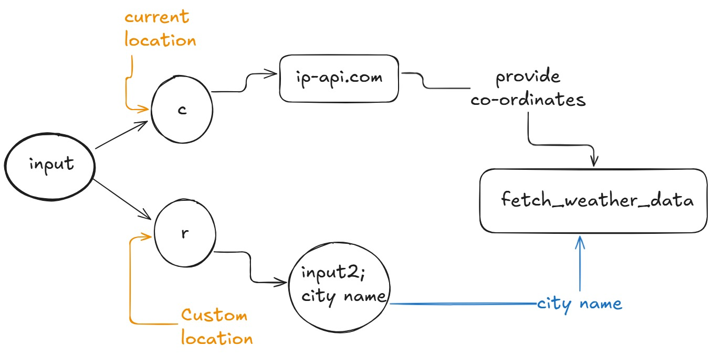

# 🌦️ CLI Weather App (Node.js)

A simple **command-line weather application** built with Node.js that lets you:

* Fetch **current weather for your location** using IP-based geolocation
* Fetch **weather details for any custom city**

The app uses environment variables for configuration and runs entirely in the terminal.



---

## 🚀 Features

* 🌍 Detects current location using IP address
* 🏙️ Fetches weather for any city name
* 🌡️ Displays temperature, condition, and feels-like temperature
* 🔐 Secure API keys using `.env`
* ⚡ Built with modern Node.js (`async/await` & `readline/promises`)

---

## 🛠️ Tech Stack

* **Node.js** (v18+ recommended)
* **Weather API** (e.g., WeatherAPI)
* **IP Geolocation API**
* `dotenv`
* Native `fetch`

---

## 📦 Installation

1. **Clone the repository**

```bash
git clone <your-repo-url>
cd <your-project-folder>
```

2. **Install dependencies**

```bash
npm install dotenv
```

> `readline/promises` and `fetch` are built-in for Node.js v18+

---

## 🔑 Environment Variables

Create a `.env` file in the root directory:

```env
ApiKey=YOUR_WEATHER_API_KEY
weatherUrl=https://api.weatherapi.com/v1
ipUrl=https://ipapi.co/json/
```

### 🔍 Variable Explanation

| Variable     | Description                 |
| ------------ | --------------------------- |
| `ApiKey`     | Your weather API key        |
| `weatherUrl` | Base URL of the weather API |
| `ipUrl`      | IP geolocation API endpoint |

---

## ▶️ How to Run

```bash
node index.js
```

You will be prompted with:

```text
If you want your Current Locations weather enter C.
If you want weather detail of Custom location enter R
```

### Options

* **C** → Fetch weather using your current IP location
* **R** → Enter a city name manually

---

## 📌 Sample Output

```text
Fetching weather data...
Weather report of Jaipur
Temperature 32 C
Weather Sunny
Feels like 35 °C
Done
```

---

## ⚠️ Notes & Limitations

* IP-based location may be inaccurate if:

  * You are using a VPN
  * Your ISP routes traffic from another city
* Requires active internet connection

---

## 🧩 Possible Improvements

* Add 5-day forecast support
* Improve error messages
* Cache last location
* Add unit toggle (°C / °F)
* Use spinner/loading indicator

---

## 👨‍💻 Author

**Rishi Jain**

If you liked this project or learned something from it, ⭐ the repo!

---

Happy coding ☁️🌈
